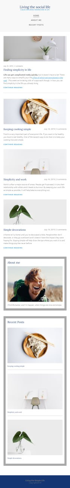

# Responsive Blog Website (Tutorial Project)

## Project Overview

This project is a responsive blog website built by following a tutorial. The primary aim of this project was to deepen my understanding of responsive design techniques using CSS units like `em`, `vh`, `vw`, `%`, `rem`, `max`, `min`, and effectively utilizing media queries to create adaptable layouts.

## Key Learnings

Through this tutorial, I gained valuable insights and practical experience in the following areas:

- **Responsive Units:** Learned how to use different CSS units (`em`, `vh`, `vw`, `%`, `rem`, `max`, `min`) to create flexible and scalable designs that adapt seamlessly to various screen sizes.

- **Efficient Use of Media Queries:** Discovered the importance of including media queries early in the CSS file, particularly for setting responsive font sizes and other key elements. This approach simplifies the development process by ensuring that responsive adjustments are applied consistently throughout the styling.

- **Adaptive Layout Techniques:** Understood how to create layouts that automatically adjust based on the viewport size, enhancing the user experience across different devices.

- **Optimizing for Readability and Usability:** Focused on maintaining readability and usability by setting appropriate font sizes and line heights, making sure the content is accessible on all devices.

## Features

- **Flexible Typography:** Utilizes responsive font sizes that adjust based on the viewport, ensuring consistent readability on all devices.

- **Scalable Layout:** Employs a combination of `vh`, `vw`, and `%` units to create a layout that scales with the screen size, providing a fluid and adaptive user interface.

- **Media Query Optimization:** Includes media queries at the beginning of the CSS file to set up responsive variables for font sizes and other properties, making the CSS easier to manage and update.

## Real-world Application

I applied the concepts learned from this tutorial to build a mythology-themed responsive blog, which can be viewed here: [Mythology Blog](https://himihiba.github.io/mythology-blog/).

## Tutorial Credit

This project was developed by following a tutorial by Kevin Powell, which provided a comprehensive guide on responsive web design techniques, focusing on the use of various CSS units and media queries. You can find the full playlist for this tutorial [here](https://youtube.com/playlist?list=PLqYFXd9GTRVWU_DqZo4D1r59ng46WdvL4&si=jgoEIkAzheAoufwH).

## Conclusion

Completing this tutorial-based project was a great way to solidify my understanding of responsive design principles and best practices. The knowledge gained from this experience will be invaluable as I continue to build more sophisticated web projects.

## Demo 

-[Responsive blog](https://himihiba.github.io/responsive_blog/)

## Screenshot

